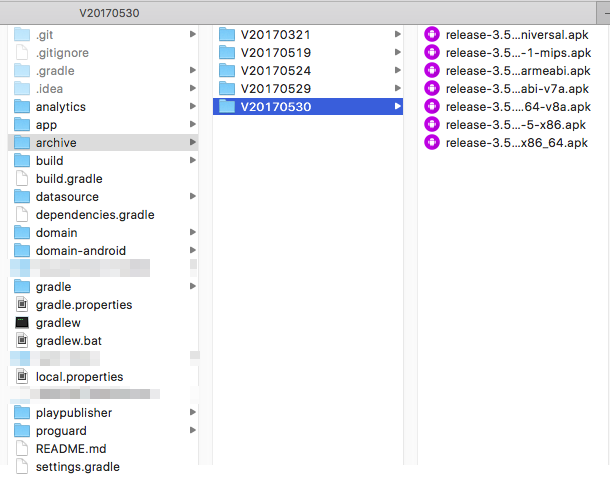

# Google Play Publisher script
Simple script for publishing android apps to Google Play Store when using multi-apk feature

## Why to use
Basically to simplify the publishing flow. When you have a multi-apk feature requirement on your project, you need to upload all apks manually and move between different tracks. With this script you can just call it from your CI and it will do all for you.

## How to use
Generate your apks:
./gradlew clean assembleRelease

If you have configured it like us, you'll have a folder e.g *archive* in your root project dir with all the apks in there. Or you can just move them manually. It's preferrable to have some structure like `V<versioncode>`. Here's our example:



```
cd playpublisher
python multiapk_upload.py ../archive/V20170530
```

The argument needs to be a folder containing all the apks to upload. 

## How to install
### This is the most important part
You'll end up spending a lot more time (like I did) if you try to install it manually. 
The best way is to just use 'brew'
`brew install python`
This comes with **pip** and **easy_install** for you to use later. 

---

After this, you'll be able to follow the install instructions from Google's script:

1. Install google-api-python-client
`pip install google-api-python-client`
2. Make sure you can import the client library:

  ```bash
  $ python
  >>> import apiclient
  >>>
  ```

3. Create **service account** and link to the project. To do it, first go to Google Play console/All aplications/Settings/API Access. What you need is the key to that account. Download it in **.json** format and put in the same directory with this script. 
4. Rename the key to be `key.json`
5. Edit the script to add your service account **email**, **app package id** and select the **track** you want to publish to.

Now you're ready to run the script and upload your apks.

## References
- [Google developer guide to multi apk](https://developer.android.com/google/play/publishing/multiple-apks.html)

- [Original script in Google's github](https://github.com/googlesamples/android-play-publisher-api/tree/master/v2/python)

- [Google Play Developer API
](https://developers.google.com/android-publisher/) wher you can find the [libraries and samples](https://developers.google.com/android-publisher/libraries)

